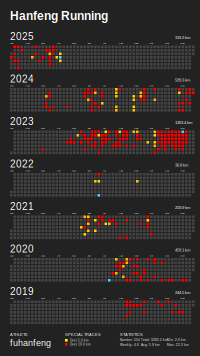

<h1> Hanfeng</h1>

Engineer focused on **OpenHarmony ArkUI** and **UI infrastructure**.

Currently maintaining the **ArkUI WaterFlow** component, with a strong interest in layout systems, rendering performance, and long-term component engineering.

Before moving deeper into UI infrastructure, I spent years building backend systems and automation tools. That background still shapes how I think about reliability, maintainability, and practical engineering.

---

### Current Focus

- Maintaining and improving OpenHarmony ArkUI WaterFlow
- UI layout systems and component infrastructure
- Performance optimization and stability under complex scenarios
- API design and long-term maintainability

---

### Background

- Backend engineering with Java, Go, Kotlin, PHP, and JavaScript
- Scalable services and automation-oriented tooling
- Product-minded engineering with an emphasis on reliability

---

### Tech Stack

**UI / Platform:**  
OpenHarmony, ArkUI, WaterFlow, component engineering, layout systems

**Languages:**  

**Backend:**  

**AI / Automation:**  

**DevOps:**  

---

### Featured Work

- OpenHarmony / ArkUI related work and WaterFlow maintenance
- [Atom Archetype](https://github.com/Archetom/Atom-Archetype) – A DDD-style Java project template for scalable, maintainable systems
- [Telegram Hub](https://github.com/lvye/telegram-hub) – RSS-to-Telegram automation powered by Cloudflare Workers

---

### Beyond Work

Long-distance running has been part of my life for years.
It influences how I build software: consistency, endurance, and steady iteration.

Check out my running logs 👉 [running.hanfeng.net](https://running.hanfeng.net)

---

### Connect with me

